# 🔓 Website Hacking – Admin Panel Access (DVWA Lab)

### 📁 Project Overview

This project demonstrates how to identify and exploit common web application vulnerabilities to gain unauthorized access to an admin panel. All tests were conducted ethically in a controlled environment using [DVWA](https://github.com/digininja/DVWA) (Damn Vulnerable Web Application), running on a local virtual machine.

> 🚨 **Disclaimer:** This project was performed strictly for educational purposes and in a secure lab environment. Never conduct unauthorized testing on real systems.

---

### 🎯 Objective

* Identify and exploit common web vulnerabilities:

  * SQL Injection
  * Command Injection
  * Cross-Site Scripting (XSS)
  * Login Bypass
* Gain access to a simulated admin panel
* Provide screenshots, steps, and recommendations for mitigation

---

### 🛠️ Environment Setup

| Component    | Details                                  |
| ------------ | ---------------------------------------- |
| OS           | Kali Linux VM (VMware)                   |
| Web App      | DVWA (PHP/MySQL-based vulnerable app)    |
| Server Stack | Apache, PHP, MariaDB                     |
| Browser      | Firefox                                  |
| Tools Used   | Terminal, Browser, Burp Suite (optional) |

### Install DVWA

 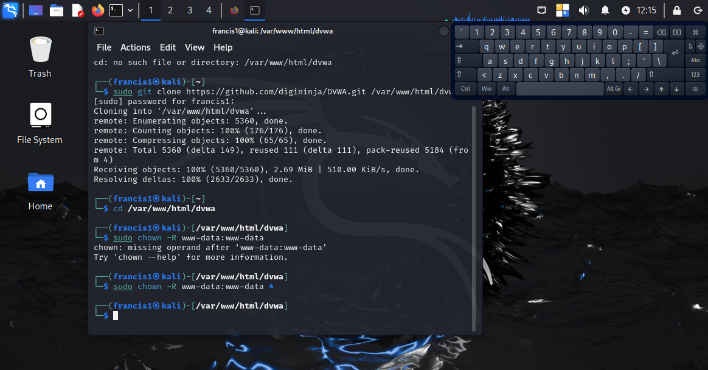

 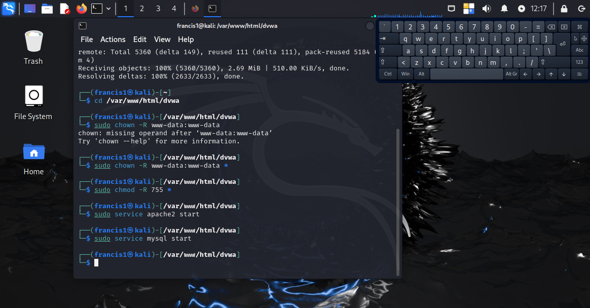

---

## 🔍 Vulnerabilities Exploited

### 1️⃣ Brute force login & SQL Injection
On the login form, I entered username (1=1) and password (password). Then the username (admin) and password (password). Then the username (admin) and password: empty/nothing.

**Result:** Login was successful despite not knowing the real credentials. SQL logic was manipulated to always return true.

 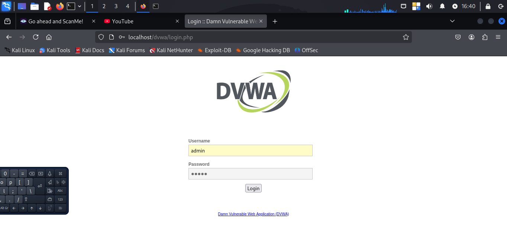

 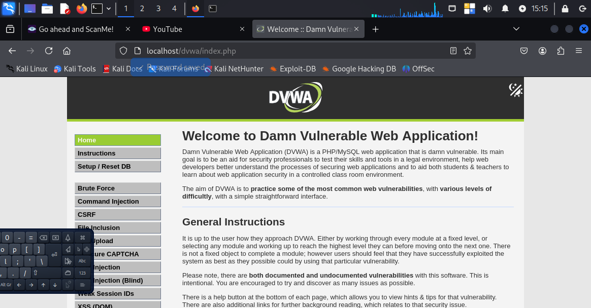 

 Then I changed the security level to Low (for ease of exploitation)

 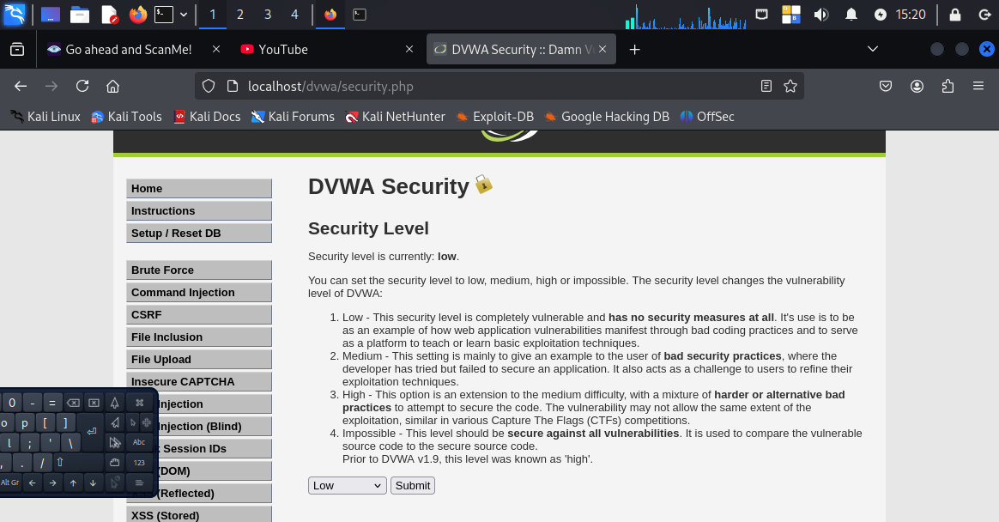

* **Why It’s Dangerous/Not Acceptable:**
Attackers can bypass authentication, steal data, or manipulate the database.

* **Mitigation:**

  * Use parameterized queries (prepared statements)
  * Input validation and sanitization
  * Disable detailed SQL error messages

---

### 2️⃣ Command Injection

* **Module:** `Command Execution`

* **Steps:**
In the command injection module, I wrote the command “127.0.0.1 && whoami” in the input field. Whereas the input field is only supposed to collect/accept IP addresses (therefore 127.0.0.1), I also included “whoami”, a system/terminal command.

**Result:**
The server responded with system-level information (`www-data`), confirming code execution.

 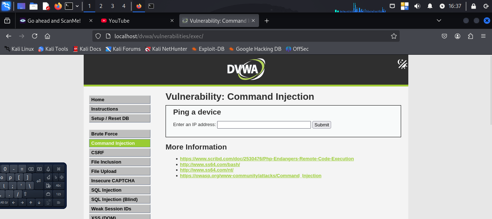

 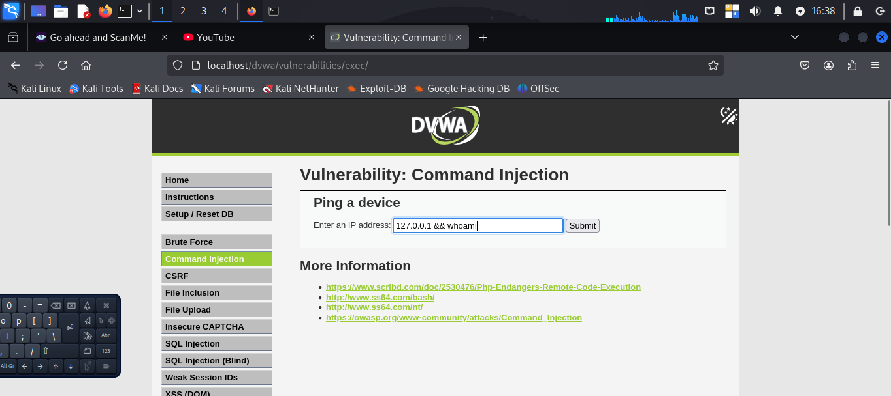

 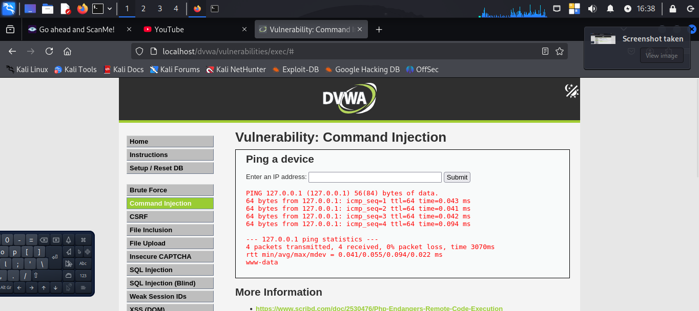

* **Why It’s Dangerous/Not Acceptable:**
Attackers can execute arbitrary commands on the server, leading to full system compromise.

* **Mitigation:**

  * Use whitelisting for allowed inputs
  * Escape special characters
  * Avoid system calls from user input

---

### 4️⃣ Admin Panel  and other hidden directories bypass

* **Steps:**
Using gobuster, I was able to detect some hidden directories and navigated to them manually, using the direct links/paths, thereby bypassing any access control on those pages

Gobuster Installation

 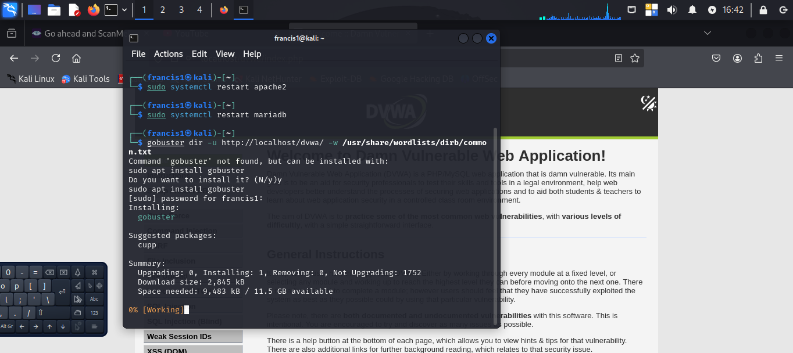

 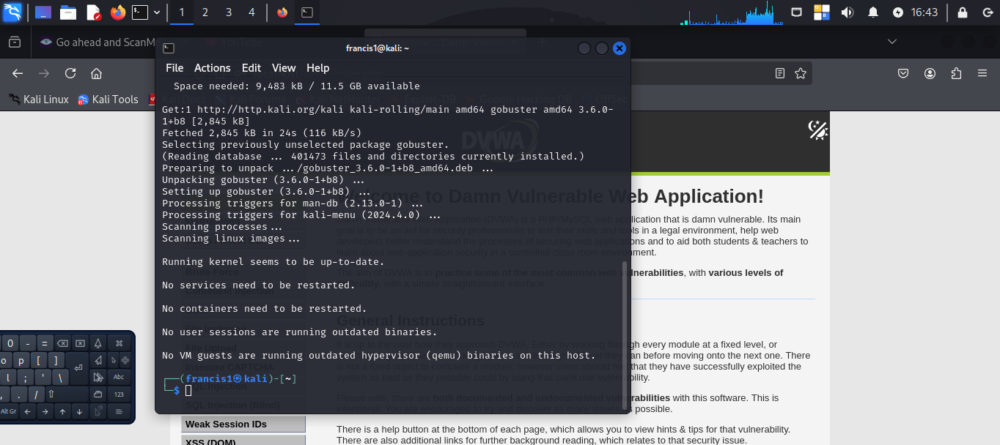

Gobuster result showing hidden directory paths

 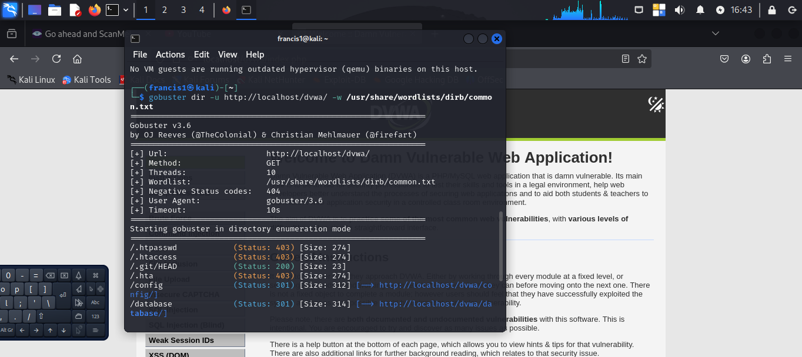

* **Result:** Successfully gained admin-level access.

 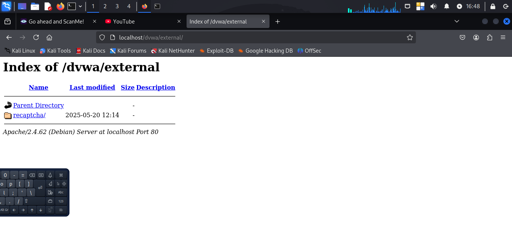

 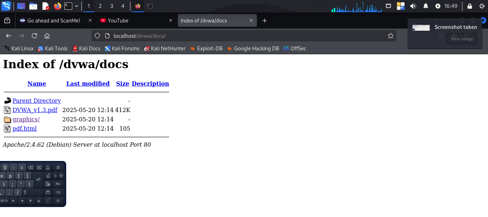

 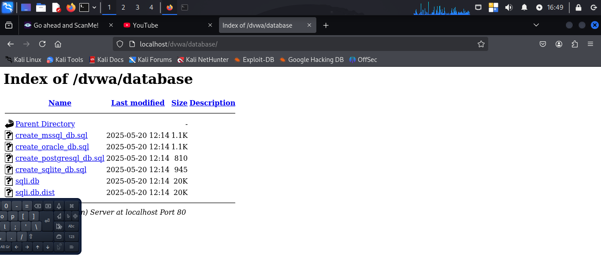

* **Why it’s not ideal:**
Unauthorized access to sensitive admin controls can lead to complete compromise
 
* **Mitigation:**

  * Secure authentication using prepared statements
  * Implement account lockout for brute-force attempts
  * Use multi-factor authentication (MFA)

---

## 🔐 General Recommendations

| Area           | Recommendation                                           |
| -------------- | -------------------------------------------------------- |
| Input Handling | Validate and sanitize all user inputs (server-side)      |
| Authentication | Use MFA, account lockout, and encrypted password storage |
| Secure Coding  | Avoid using system calls, use secure frameworks          |
| Headers        | Add security headers (CSP, X-Frame-Options, etc.)        |
| Logging        | Log authentication attempts and anomalies                |
| Access Control | Enforce least privilege, protect admin URLs              |

---

## 💬 Reflections

This lab simulated real-world attacks on insecure web applications. The ease with which basic input manipulation compromised login systems, executed commands, and triggered script injection shows the **critical importance of secure coding** and proper validation practices.

---

## 📚 What I Learned

* Hands-on exploitation of common vulnerabilities
* Importance of sanitizing user inputs
* How misconfigurations can lead to privilege escalation
* Steps to mitigate risks in real-world scenarios

---

## 📎 Related Tools & Resources

* [DVWA GitHub Repo](https://github.com/digininja/DVWA)
* [OWASP Top 10](https://owasp.org/www-project-top-ten/)
* [Kali Linux](https://www.kali.org/)
* [Burp Suite](https://portswigger.net/burp)
* [OWASP Cheat Sheets](https://cheatsheetseries.owasp.org/)

---

Date created: 23/05/2025
